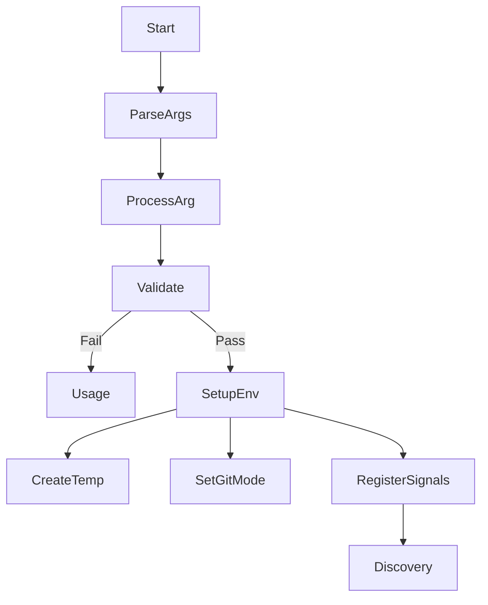
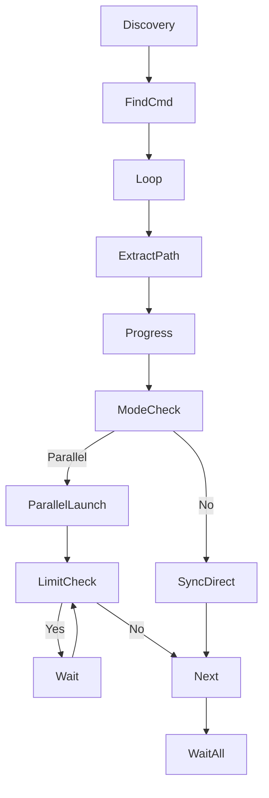
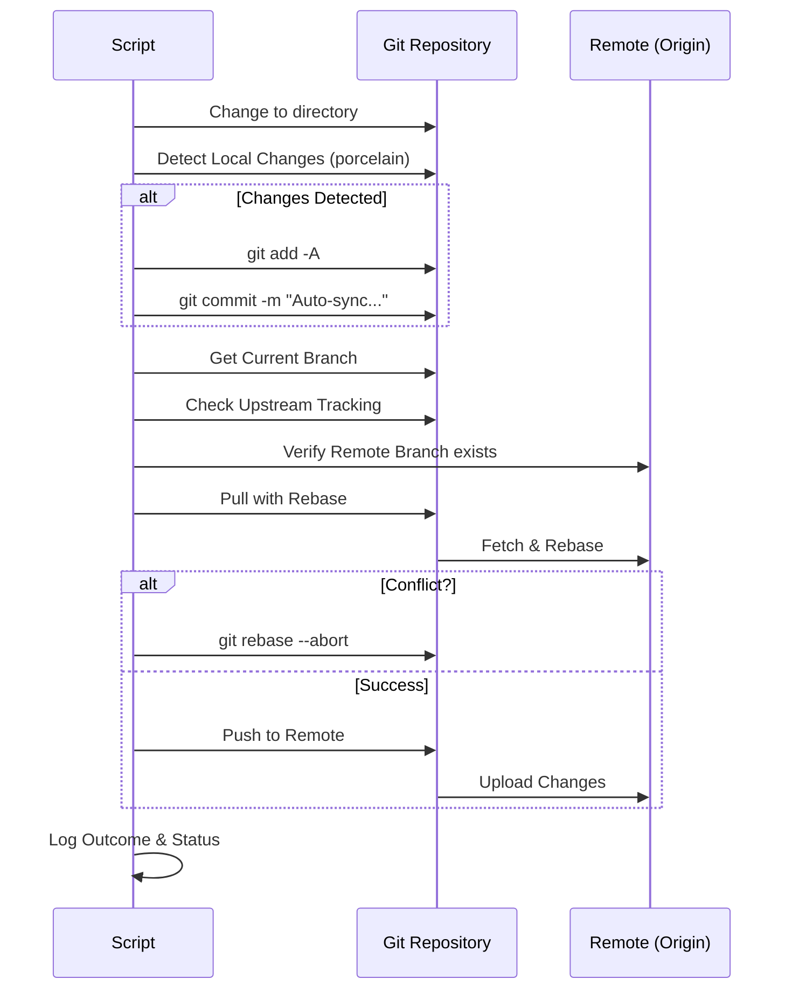
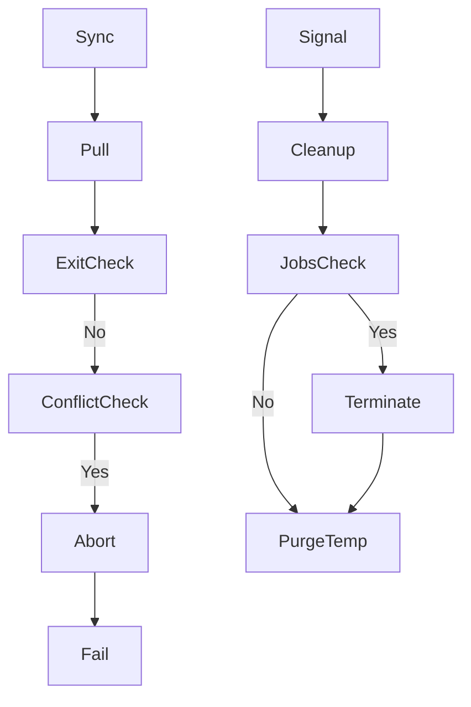
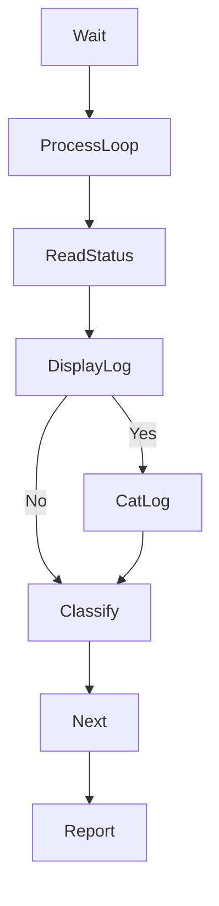

# Git Autosync - Execution Flow & Architecture Charts

This document provides a visual and structured breakdown of the `git_autosync.sh` script's execution flow, based on the system codemap.

## 1. Script Initialization and Argument Processing
The main entry point that parses command-line arguments and sets up the execution environment.

### Key Locations
| ID | Title | Description | Code | Path:Line |
|:---|:---|:---|:---|:---|
| **1a** | Argument Parsing Loop | Iterates through command-line arguments to configure sync behavior | `while [[ $# -gt 0 ]]` | `git_autosync.sh:66` |
| **1b** | Base Directory Validation | Ensures required base folder parameter is provided | `if [[ -z "$BASE_DEV_DIR" ]]` | `git_autosync.sh:125` |
| **1c** | Temporary Directory Creation | Creates temp directory for parallel process communication | `mktemp -d` | `git_autosync.sh:133` |
| **1d** | Signal Handler Setup | Registers cleanup function for graceful shutdown | `trap cleanup EXIT...` | `git_autosync.sh:156` |

---

## 2. Repository Discovery and Processing Loop
Finds all git repositories recursively and orchestrates their processing.

### Key Locations
| ID | Title | Description | Code | Path:Line |
|:---|:---|:---|:---|:---|
| **2a** | Repository Discovery Loop | Iterates through all .git directories found recursively | `while IFS= read...` | `git_autosync.sh:384` |
| **2b** | Directory Extraction | Extracts parent directory path from .git location | `dirname` | `git_autosync.sh:386` |
| **2c** | Parallel Process Launch | Starts sync_repo function in background for parallel execution | `sync_repo &` | `git_autosync.sh:396` |
| **2d** | Job Limit Management | Waits when max parallel jobs reached | `jobs -p | wc -l` | `git_autosync.sh:405` |
| **2e** | Find Command Execution | Finds all .git directories using null-delimited output | `find -name ".git"` | `git_autosync.sh:412` |

---

## 3. Single Repository Synchronization Logic
Core git operations performed on each repository.

### Key Locations
| ID | Title | Description | Code | Path:Line |
|:---|:---|:---|:---|:---|
| **3a** | Directory Navigation | Changes to repository directory with error handling | `pushd` | `git_autosync.sh:179` |
| **3b** | Local Changes Detection | Checks for uncommitted changes using porcelain format | `git status --porcelain` | `git_autosync.sh:201` |
| **3c** | Stage All Changes | Stages all modifications including deletions and new files | `git add -A` | `git_autosync.sh:216` |
| **3d** | Pull with Rebase | Pulls remote changes using rebase strategy | `git pull --rebase` | `git_autosync.sh:280` |
| **3e** | Push to Remote | Pushes local commits to remote repository | `git push` | `git_autosync.sh:302` |

---

## 4. Error Handling and Conflict Resolution
Manages errors, conflicts, and cleanup operations during synchronization.

### Key Locations
| ID | Title | Description | Code | Path:Line |
|:---|:---|:---|:---|:---|
| **4a** | Pull Error Detection | Checks if pull operation failed | `if [[ $pull_exit -ne 0 ]]` | `git_autosync.sh:289` |
| **4b** | Rebase Conflict Detection | Detects ongoing rebase conflicts | `if [[ -d ".git/rebase..." ]]` | `git_autosync.sh:290` |
| **4c** | Rebase Abort | Cleans up failed rebase to restore repository state | `git rebase --abort` | `git_autosync.sh:292` |
| **4d** | Background Process Collection | Gathers PIDs of all background jobs for cleanup | `jobs -p` | `git_autosync.sh:144` |
| **4e** | Process Termination | Gracefully terminates background processes on interrupt | `kill -TERM` | `git_autosync.sh:148` |

---

## 5. Results Aggregation and Reporting
Collects and displays results from parallel repository processing.

### Key Locations
| ID | Title | Description | Code | Path:Line |
|:---|:---|:---|:---|:---|
| **5a** | Wait for Completion | Waits for all background processes to finish | `wait` | `git_autosync.sh:415` |
| **5b** | Results Processing Loop | Iterates through all processed repositories | `for (( i=1; i<=... ))` | `git_autosync.sh:421` |
| **5c** | Status Reading | Reads processing status from temp files | `cat "$status_f"` | `git_autosync.sh:427` |
| **5d** | Result Classification | Categorizes results for summary statistics | `case "$outcome" in` | `git_autosync.sh:436` |
| **5e** | Summary Report | Displays final statistics of sync operation | `echo "Total..."` | `git_autosync.sh:445` |
