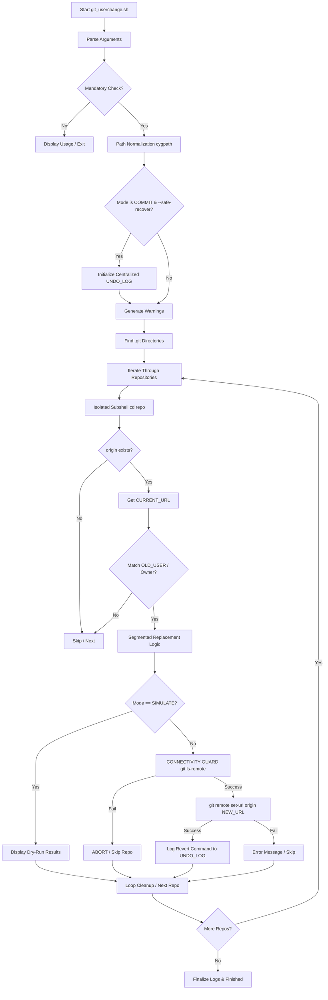

# Git UserChange - Documentation

## 1. Application Overview & Objectives
`git_userchange.sh` is a high-level administrative tool designed for mass-managing Git remote URLs across large directory structures. Its primary objective is to migrate repository "ownership" (usernames or organization names) while ensuring **maximum safety** and **zero data loss**.

### Core Objectives:
*   **Mass Migration**: Recursively find and update multiple Git repositories in minutes.
*   **Data Preservation**: Avoid "greedy" string replacement that could mangle domain names or `.git` suffixes.
*   **Connectivity Guard**: Verify the existence of the new remote URL *before* modifying local configurations.
*   **Rollback Security**: Provide a one-click recovery mechanism via automated Undo logs.
*   **Cross-Platform Portability**: Seamlessly operate between Windows (Cygwin/MSYS) and native Linux systems.

---

## 2. Architecture & Design Choices
The script follows a "Defense-in-Depth" architectural approach:

### 🛠️ Key Design Patterns:
*   **Isolated Subshells**: Each repository is processed in a temporary subshell `( ... )`. This prevents a `cd` failure or a fatal Git error from crashing the entire discovery loop.
*   **Segmented Path Regex**: Instead of standard string substitution, the script uses a dual-logic regex engine to target only the "owner" segment of the URI.
*   **Non-Interactive Execution**: By setting `GIT_TERMINAL_PROMPT=0`, the script ensures it fails fast if authentication is missing, rather than hanging for human input.
*   **Normalization Layer**: Uses `cygpath` to resolve Windows paths (e.g., `E:\repos`) into Unix-compatible paths, allowing users to copy-paste directly from Windows Explorer.

---

## 3. Data Flow and Control Logic

### Operational Flow Diagram


---

## 4. Dependencies
The script is designed to be lightweight, relying on standard Unix utilities available in most environments:

*   **Bash (v3.0+)**: Required for Regex matching (`[[ ... =~ ... ]]`).
*   **Git**: Must be installed and accessible in the system `$PATH`.
*   **Findutils**: Standard Unix `find` command.
*   **Cygpath (Optional)**: Specifically required for Windows path normalization in Cygwin/MSYS.
*   **Standard Sed/AWK**: For output formatting.

---

## 5. Command Line Arguments

| Argument | Type | Default | Description |
| :--- | :--- | :--- | :--- |
| `--base-path=<path>` | Path | *(Required)* | The root directory to scan for Git repositories. |
| `--old-gituser=<old>` | String | *(Required)* | The existing username/org to be replaced. |
| `--new-gituser=<new>` | String | *(Required)* | The target username/org for the update. |
| `--simulate` | Flag | `false` | Dry-run mode. Prints changes without applying them. |
| `--commit` | Flag | `false` | Execute mode. Updates repo configs. |
| `--safe-recover` | Flag | `false` | Optional during `--commit`. Generates a rollback script. |
| `--display-remotes` | Flag | `false` | Exclusive mode. Audits all remotes in the base path. |
| `-h, --help` | Flag | `false` | Displays the help menu. |

---

## 6. Usage Examples

### Audit All Remotes (Status Report)
Perform a project-wide audit to see where your remotes currently point:
```bash
./git_userchange.sh --base-path=E:/data/repos --display-remotes
```

### Safe Simulation (Dry Run)
Verify which URLs will be changed without modifying any data:
```bash
./git_userchange.sh --base-path=E:/data/repos --old-gituser=old-org --new-gituser=new-org --simulate
```

### Full Commit with Rollback Protection
Execute the migration with pre-flight connectivity checks and a safe-recovery script:
```bash
./git_userchange.sh --base-path=E:/data/repos --old-gituser=old-org --new-gituser=new-org --commit --safe-recover
```

### Recovery from Failure
If a batch update causes issues, simply run the generated undo script:
```bash
# Path provided by the script output at the end of a commit run
/tmp/git/undo_git_changes_20260330_215800.sh
```
