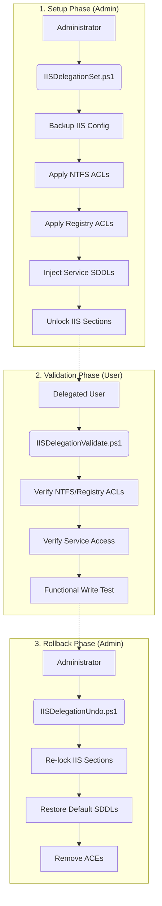

# IIS Delegation Architecture

This document describes the architectural design, control logic, and dependencies for the IIS Delegation toolset.

## 1. Architecture and Design Choices

The toolset is designed around the principle of **Least Privilege Delegation** through **OS-Level Security Injection**. Instead of adding users to the local Administrators group, we surgically grant permissions to the specific resources required by the IIS Management APIs.

### Key Design Choices:
*   **Layered Security Injection:** Permissions are applied across four distinct Windows subsystems: NTFS (File System), Registry, Service Control Manager (SCM), and IIS Configuration (XML Schema).
*   **Atomic Operations:** Each script is designed to perform a specific phase of the delegation lifecycle (Set, Undo, Validate).
*   **Non-Destructive Backups:** Forced configuration backups are performed before any modification to ensure recoverability.
*   **SID-Based Service Security:** Using `sc.exe sdset` with specific ACE strings ensures that non-admins can control `W3SVC` and `WAS` services without full administrative rights.

## 2. Data Flow and Control Logic

### 2.1. Operational Flow (Mermaid Diagram)

### 2.2. Data Sequences
1.  **Backup Sequence:** The `BackupLocation` is resolved (defaulting to `%TEMP%`). A timestamped folder is created, and the entire `%windir%\system32\inetsrv\config` directory is mirrored.
2.  **Permission Injection Sequence:** 
    *   The Group Name is resolved to a SID.
    *   NTFS `Modify` rights are granted to `config` and `appPools` temp folders.
    *   Registry `FullControl` is granted to `InetStp`.
    *   The Service Security Descriptor (SDDL) is retrieved, modified with the group SID, and re-applied.
3.  **Validation Sequence:** The script attempts to read ACLs and perform a `Set-WebConfigurationProperty` call to simulate a real-world management action.

## 3. Dependencies

### 3.1. Required PowerShell Modules:
*   **WebAdministration:** Core module for IIS management.

### 3.2. System Utilities:
*   **sc.exe:** Used for manipulating Service Security Descriptors (SDDL).

### 3.3. OS Requirements:
*   **Windows Server 2012+ / Windows 10+**
*   **IIS 7.5+**
*   **PowerShell 5.1 or PowerShell 7.x**

### 3.4. Permissions:
*   **Administrator privileges** are required to run `IISDelegationSet.ps1` and `IISDelegationUndo.ps1`.
*   **Standard User (in Delegated Group)** context is required for `IISDelegationValidate.ps1`.
